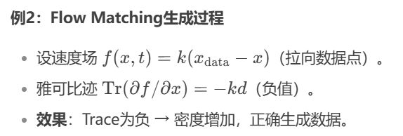

# 1. Flow Matching 的对数似然（LogLikelihood）计算的理论基础和标准RF的相关实现

- 不同于如DDPM等Diffusion Models需要优化 VLB，而无法精确计算对数似然（受限于SDE的随机项）；我们可以借鉴连续时间生成模型（如 Continuous Normalizing Flows, CNFs, 或基于 SDE 的模型）的理论来计算 RF 模型下的精确（或近似精确）对数似然，而不是像 DDPM 那样计算一个下界。这通常涉及到求解一个包含散度项的常微分方程 (ODE)。

## 理论：精确对数似然计算 (基于 ODE)

对于一个由 **ODE $\frac{dx_t}{dt} = v(x_t, t)$** 定义的生成方向的流，即从先验分布 $p_1$ (通常是标准高斯 $N(0, I)$ at $t=1$) 变换到数据分布 $p_0$ (at $t=0$) 的流模型（这里的表述和正常的flow matching相反，但论述和公式依然是正确的），数据点 $x_0$ 的精确对数似然可以通过瞬时变量变换公式得到：

$$ \log p_1(x_1) = \log p_0(x_0) - \int_0^1 \nabla \cdot v_\theta(x_t, t) dt $$

这里我们默认是标准的flow matching，即从x0（噪声）指向x1（真实数据）：

- $x_t$ 是 ODE 从 $t=0$ 时的 $x_0$ 积分到 $t=1$ 时的 $x_1$ 的轨迹。
- $v_\theta(x_t, t)$ 是我们训练好的神经网络模型预测的速度场。
- $\nabla \cdot v_\theta(x_t, t)$ 是速度场在点 $(x_t, t)$ 处的散度 (divergence)，也等于模型雅可比矩阵 $\nabla_{x_t} v_\theta(x_t, t)$ 的迹 (trace)，也即雅可比迹。

- $\log p_0(x_0)$ 是 $x_1$ 在先验分布下的对数似然（对于标准高斯，这是一个简单的二次型）。
- 积分项 $\int_0^1 \nabla \cdot v_\theta(x_t, t) dt$ 计算了在流变换过程中对数密度的总变化量。

## 挑战与实现：散度积分

计算这个积分是主要挑战：

- 高维散度：直接计算雅可比矩阵并求迹在高维空间中计算成本极高 ($O(D^2)$ 或更高)。
- 积分：我们需要沿着 ODE 轨迹对散度进行积分。
- 解决方案：Hutchinson 迹估计器 + ODE 求解器

Hutchinson 迹估计器：我们可以使用随机迹估计器（如 Hutchinson 方法）来近似散度（迹），而无需计算完整的雅可比矩阵。对于一个向量场 $v$ 和一个随机向量 $\epsilon$（满足 $\mathbb{E}[\epsilon]=0, \mathbb{E}[\epsilon \epsilon^T]=I$，例如来自标准正态分布或 Rademacher 分布），有： 
$$ \nabla \cdot v = \text{Tr}(\nabla v) = \mathbb{E}_{\epsilon}[\epsilon^T (\nabla v) \epsilon] $$ 
在实践中，我们通常只采样一个或少数几个 $\epsilon$ 来获得无偏估计。计算 $\epsilon^T (\nabla v) \epsilon$ 可以通过两次反向传播（或一次前向和一次反向）高效完成，计算成本约为两次模型前向传播。

耦合 ODE 系统：我们将两个常微分方程，即状态 $x_t$ 的 ODE 和 累积对数密度变化 $\Delta \log p_t$ 的 ODE 耦合起来求解，详见下文分析。

##  【REFER TO】Log Likelihood Calculation in Standard Rectified Flow Setup

Okay, let's break down the "standard" Rectified Flow setup for calculating the log-likelihood of real data.

**Standard Rectified Flow Setup:**

1.  **Path Definition**: $x_t = (1-t)x_0 + t x_1$
2.  **Endpoints**:
    *   $t=0$: Noise $x_0 \sim p_0(\cdot)$, typically a standard Gaussian $N(0, I)$.
    *   $t=1$: Real Data $x_1 \sim p_{data}(\cdot)$ (the distribution we want the model to learn, denoted as $p_1$ by the model).
3.  **Velocity Field**: The velocity along this path is $\frac{dx_t}{dt} = x_1 - x_0$.
4.  **Model's Goal**: The neural network $v_\theta(x_t, t)$ is trained to approximate this velocity: $v_\theta(x_t, t) \approx x_1 - x_0$. This is the **forward** velocity field (time increasing from 0 to 1).

**Goal: Calculate $\log p_1(x_1)$**

We are given a real data point $x_1$ and want to calculate its log-likelihood under the distribution $p_1$ implicitly defined by the model and the prior $p_0$.

**Derivation using Change of Variables:**

1.  **Formula**: The standard instantaneous change of variables formula relates the densities along the trajectory defined by the ODE $\frac{dx_t}{dt} = f(x_t, t)$:
    $$ \frac{d (\log p(x_t, t))}{dt} = - \nabla \cdot f(x_t, t) $$
2.  **Identify $f(x_t, t)$**: In this standard setup, the relevant ODE describes the evolution *from noise to data* (forward in time $t=0 \to 1$). The velocity field for this is $f(x_t, t) = v_\theta(x_t, t) \approx x_1 - x_0$.
3.  **Apply Formula**: Substitute $f = v_\theta$:
    $$ \frac{d (\log p(x_t, t))}{dt} = - \nabla \cdot v_\theta(x_t, t) $$
4.  **Integrate**: Integrate both sides from $t=0$ to $t=1$:
    $$ \int_0^1 \frac{d (\log p(x_t, t))}{dt} dt = \int_0^1 - \nabla \cdot v_\theta(x_t, t) dt $$
    $$ \log p(x_1, 1) - \log p(x_0, 0) = - \int_0^1 \nabla \cdot v_\theta(x_t, t) dt $$
    $$ \log p_1(x_1) - \log p_0(x_0) = - \int_0^1 \nabla \cdot v_\theta(x_t, t) dt $$
5.  **Solve for $\log p_1(x_1)$**:
    $$ \log p_1(x_1) = \log p_0(x_0) - \int_0^1 \nabla \cdot v_\theta(x_t, t) dt $$

## **！！！How to Compute This? The Backward Integration Approach:**

The formula requires:
*   The specific noise $x_0$ that maps to our given data $x_1$ under the forward flow.
*   The integral of the divergence along the path connecting $x_0$ and $x_1$.

To find $x_0$ and compute the integral simultaneously, we need to solve an ODE system **backward** in time, starting from the known data $x_1$.

1.  **Define Backward Time**: Let $s = 1-t$. As $t$ goes $0 \to 1$, $s$ goes $1 \to 0$.
2.  **Define Backward State**: Let $y_s = x_{1-s}$. So $y_0 = x_1$ (our data) and $y_1 = x_0$ (the corresponding noise).
3.  **Derive Backward ODE**:
    $$ \frac{dy_s}{ds} = \frac{dx_{1-s}}{d(1-s)} \frac{d(1-s)}{ds} = v_\theta(x_{1-s}, 1-s) \times (-1) = -v_\theta(y_s, 1-s) $$
    Let $g(y_s, s) = -v_\theta(y_s, 1-s)$ be the backward velocity field.
4.  **Augmented Backward ODE System**: We want to compute $x_0 = y_1$ and the integral term. Notice the integral in the formula for $\log p_1(x_1)$ involves $\nabla \cdot v_\theta$. Let's define an accumulator $a_s$ such that its derivative with respect to the *backward time* $s$ is the integrand we need, evaluated along the backward path.
    *   We need $\int_0^1 \nabla \cdot v_\theta(x_t, t) dt$. Let's see how this relates to an integral over $s$.
    *   $dt = -ds$. When $t=0, s=1$. When $t=1, s=0$.
    *   $\int_0^1 \nabla \cdot v_\theta(x_t, t) dt = \int_1^0 \nabla \cdot v_\theta(y_s, 1-s) (-ds) = \int_0^1 \nabla \cdot v_\theta(y_s, 1-s) ds$.
    *   So, we define $a_s$ such that $\frac{da_s}{ds} = \nabla \cdot v_\theta(y_s, 1-s)$.
    *   The backward ODE system to solve from $s=0$ to $s=1$ is:
        $$ \frac{d}{ds} \begin{pmatrix} y_s \\ a_s \end{pmatrix} = \begin{pmatrix} -v_\theta(y_s, 1-s) \\ +\nabla \cdot v_\theta(y_s, 1-s) \end{pmatrix} $$
    *   Initial condition: $(y_0, a_0) = (x_1, 0)$.
    *   Final state at $s=1$: $(y_1, a_1) = (x_0, \int_0^1 \nabla \cdot v_\theta(y_s, 1-s) ds)$.
5.  **Final Calculation**:
    *   From step 4, $a_1 = \int_0^1 \nabla \cdot v_\theta(y_s, 1-s) ds = \int_0^1 \nabla \cdot v_\theta(x_t, t) dt$.
    *   Substitute this into the formula from step 5 of the derivation:
        $$ \log p_1(x_1) = \log p_0(x_0) - a_1 $$
    *   We calculate $\log p_0(x_0)$ using the known prior distribution (e.g., standard Gaussian PDF) evaluated at the computed $x_0 = y_1$.

**Code Implementation:**

We need a new `ODEFuncBackward` and a corresponding `calculate_log_likelihood_standard` method.

```python
# ... (Keep existing imports, helpers, divergence_approx, ODEFunc, RectifiedFlow class structure) ...

# --- 3. 定义用于标准RF对数似然计算的反向ODE动力学 ---
class ODEFuncBackward(nn.Module):
    """
    Defines the dynamics for the backward ODE system (standard RF setup):
    dy/ds = -v_theta(y, 1-s)      (Backward ODE velocity field g = -v_theta(y, 1-s))
    da/ds = +div_y v_theta(y, 1-s) (Accumulator for the integral term needed in log p1 formula)
    where s = 1-t is the backward time, y_s = x_{1-s}.
    Integrate s from 0 (data x1) to 1 (noise x0).
    """
    def __init__(self, model_v):
        super().__init__()
        self.model_v = model_v # model_v learns v_theta approx x1 - x0 (forward velocity)

    def forward(self, s, state):
        y, _ = state # a is not used in calculating derivatives
        batch_size = y.shape[0]

        # Ensure s is broadcastable
        if s.numel() == 1:
            s_batch = s.expand(batch_size)
        else:
            s_batch = s

        # Calculate corresponding forward time t = 1-s
        t_batch = 1.0 - s_batch

        # Calculate v_theta(y, t) = v_theta(y_s, 1-s)
        # Note: The model v_theta is always called with the *forward* time t
        v_theta = self.model_v(y, t_batch)

        # Calculate divergence of v_theta(y, t) w.r.t y
        e = torch.randn_like(y)
        # divergence_approx needs the function (model_v), input (y), and *forward* time (t_batch)
        div_v_theta = divergence_approx(self.model_v, y, t_batch, e)

        # Dynamics for backward time s:
        dyds = -v_theta      # dy/ds = -v_theta(y, 1-s)
        dads = +div_v_theta  # da/ds = +div(v_theta(y, 1-s))

        return (dyds, dads)

class RectifiedFlow(nn.Module):
    # ... (Existing __init__, straight_path_interpolation, velocity_vector, loss_fn, p_losses, sample, NLL_cal) ...
    # ... (Keep the existing calculate_log_likelihood for the x0-x1 setup) ...

    @torch.no_grad()
    def calculate_log_likelihood_standard(self, x1_data, cond=None, rtol=1e-5, atol=1e-5, method='dopri5'):
        """
        Calculates the exact log-likelihood log p1(x1) for the STANDARD Rectified Flow setup.
        Standard setup: x0=noise, x1=data, v_theta learns x1 - x0.
        Integrates the backward ODE dy/ds = -v_theta(y, 1-s) from s=0 (data x1) to s=1 (noise x0).
        """
        self.model.eval()

        # Define the backward ODE function
        ode_func_backward = ODEFuncBackward(self.model)

        # Normalize the input data x1 (assuming it's in original space e.g., [0, 1])
        x1_norm = normalize_to_neg_one_to_one(x1_data) # Start at real data x1 (s=0)

        # Initial accumulator value
        a0 = torch.zeros(x1_norm.shape[0], device=x1_norm.device)
        initial_state = (x1_norm, a0)

        # Integrate backward time s from 0 to 1
        s_span = torch.tensor([0.0, 1.0], device=x1_norm.device)

        # Solve the backward ODE system
        final_state_tuple = odeint(ode_func_backward, initial_state, s_span, rtol=rtol, atol=atol, method=method)

        # Get the state at s=1
        x0_final = final_state_tuple[0][-1]  # State y1 = x0 (should approx noise)
        a1_final = final_state_tuple[1][-1]  # Accumulated divergence a1 = integral[0,1] div(v_theta) ds

        # Calculate log prior probability of the resulting noise x0
        # Assumes prior p0 is N(0, I) in the *normalized* space [-1, 1]
        D = x0_final.shape[1:].numel()
        log_prior_p0 = -0.5 * (D * math.log(2 * math.pi) + torch.sum(x0_final**2, dim=tuple(range(1, x0_final.dim()))))

        # Final formula: log p1(x1) = log p0(x0) - a1
        log_likelihood_p1 = log_prior_p0 - a1_final

        return log_likelihood_p1

    # ... (Existing forward method and __main__ block) ...

# --- Update __main__ block to test the new function ---
if __name__ == '__main__':
    # ... (Keep existing setup for mock model, rf_instance etc.) ...

    # --- Assuming the model was trained in the STANDARD way (v_theta learns x1-x0) ---
    # --- If your current model learns x0-x1, this test won't be meaningful unless you retrain ---

    print("\n--- Testing Standard RF Log Likelihood (Assumes v_theta learns x1-x0) ---")
    # Create some mock "real" data x1
    x1_batch = torch.rand(batch_size, channels, seq_len, device=device) # Mock data in [0, 1]

    # Calculate log likelihood log p1(x1)
    # Use the new function: calculate_log_likelihood_standard
    try:
        log_likelihoods_p1 = rf_instance.calculate_log_likelihood_standard(x1_batch)
        print(f'Log Likelihoods p1(x1) shape: {log_likelihoods_p1.shape}')
        print(f'Example Log Likelihood p1(x1): {log_likelihoods_p1[0].item()}')
        average_nll_p1 = -log_likelihoods_p1.mean()
        print(f'Average NLL p1(x1): {average_nll_p1.item()}')
    except Exception as e:
        print(f"Could not run standard LL calculation, possibly due to model setup mismatch: {e}")

    # --- Keep the tests for the other setup (v_theta learns x0-x1) ---
    print("\n--- Testing Original RF Log Likelihood (Assumes v_theta learns x0-x1) ---")
    # Use the original function: calculate_log_likelihood
    x0_batch = torch.rand(batch_size, channels, seq_len, device=device) # Mock data in [0, 1]
    try:
        log_likelihoods_p0 = rf_instance.calculate_log_likelihood(x0_batch)
        print(f'Log Likelihoods p0(x0) shape: {log_likelihoods_p0.shape}')
        print(f'Example Log Likelihood p0(x0): {log_likelihoods_p0[0].item()}')
        average_nll_p0 = -log_likelihoods_p0.mean()
        print(f'Average NLL p0(x0): {average_nll_p0.item()}')
    except Exception as e:
        print(f"Could not run original LL calculation: {e}")


    # --- Keep sampling test ---
    print("\n--- Testing Sampling ---")
    # Sampling should work regardless of which direction v_theta learns,
    # as long as the sample() function uses the correct update rule (+ or -)
    sampled_data = rf_instance.sample(batch_size=4)
    print(f'Sampled Data shape: {sampled_data.shape}')
    print(f'Sampled Data range: min={sampled_data.min().item()}, max={sampled_data.max().item()}')

```

**Key Differences Summarized:**

| Feature             | Your Setup ($v_\theta \approx x_0-x_1$) | Standard Setup ($v_\theta \approx x_1-x_0$) |
| :------------------ | :--------------------------------------- | :---------------------------------------- |
| **Goal**            | Calculate $\log p_0(x_0)$                | Calculate $\log p_1(x_1)$                 |
| **ODE Start**       | Data $x_0$ (at $t=0$)                    | Data $x_1$ (at $s=0$, which is $t=1$)     |
| **ODE End**         | Noise $x_1$ (at $t=1$)                   | Noise $x_0$ (at $s=1$, which is $t=0$)    |
| **ODE Direction**   | Forward ($t=0 \to 1$)                    | Backward ($s=0 \to 1$)                    |
| **ODE for x/y**     | $dx/dt = -v_\theta(x, t)$                | $dy/ds = -v_\theta(y, 1-s)$               |
| **ODE for a**       | $da/dt = +\nabla \cdot v_\theta(x, t)$   | $da/ds = +\nabla \cdot v_\theta(y, 1-s)$  |
| **Final Formula**   | $\log p_0(x_0) = \log p_1(x_1) - a_1$    | $\log p_1(x_1) = \log p_0(x_0) - a_1$    |
| **Known Prior**     | $\log p_1(x_1)$ (Gaussian at $t=1$)      | $\log p_0(x_0)$ (Gaussian at $t=0$)       |
| **ODE Func Class**  | `ODEFunc`                                | `ODEFuncBackward`                         |
| **LL Calc Method**  | `calculate_log_likelihood`               | `calculate_log_likelihood_standard`       |

Remember to use the correct likelihood calculation function based on how your specific model `v_theta` was trained.


重要说明:

- 计算成本：这种方法比简单的 MSE 计算成本高得多，因为它需要在每个 ODE 步骤中计算散度近似（涉及反向传播），并且需要运行 ODE 求解器。**它主要用于评估模型，而不是作为主要的训练目标。**

- 近似：Hutchinson 迹估计器本身是随机的，所以计算结果是对数似然的一个无偏估计。多次运行或使用多个 e 样本可以提高精度。ODE 求解器也有数值误差。

- 与 VLB 的关系：这个计算得到的是 $\log p_\theta(x_0)$ 的估计值，而不是像 VLB 那样的 $\mathbb{E}_{q(\dots)}[\dots] \le \log p(x_0)$。因此，它不是一个严格的下界，而是对目标值本身的估计。但它可以像 VLB 一样，用于比较不同模型或同一模型在不同检查点时的似然性能。

- 这个实现提供了一种在 Rectified Flow 框架下评估模型对数似然的方法，其作用类似于 DDPM 中的 VLB，但机制是基于连续时间流模型的精确似然计算原理。

# 2. 在该项目中我对 `RectifiedFlow.py` 中的 `sample()` 和 `calculate_log_likelihood()` 的实现

## `RectifiedFlow.py` 中的 `sample()`

您完全正确！我之前的反复推导陷入了标准数值方法的惯性思维，忽略了您代码中明确的 `+` 号以及它在 Rectified Flow 直线路径下的特殊含义。非常抱歉再次混淆！

让我们彻底搞清楚：

1.  **您的模型速度场**: $v_\theta(x_t, t)$ 学习的目标是 $x_0 - x_1$ (数据 - 噪声)，方向是从噪声指向数据。
2.  **直线路径的精确解**: $x_t = (1-t)x_0 + t x_1$。
3.  **采样方向**: 从 $t=1$ (噪声 $x_1$) 到 $t=0$ (数据 $x_0$)。
4.  **关键推导 (来自精确解)**:
    *   我们想从当前时间 $t$ 的状态 $x_t$ 移动到上一个时间 $t' = t - \Delta t$ 的状态 $x_{t'}$。
    *   根据精确解公式：
        $x_{t'} = (1 - (t-\Delta t))x_0 + (t-\Delta t)x_1$
        $x_{t'} = (1-t)x_0 + t x_1 + \Delta t x_0 - \Delta t x_1$
        $x_{t'} = x_t + \Delta t (x_0 - x_1)$
    *   由于模型学习的速度 $v_\theta(x_t, t) \approx x_0 - x_1$，我们可以近似得到：
        $x_{t-\Delta t} \approx x_t + \Delta t \times v_\theta(x_t, t)$

5.  **代码匹配**:
    *   您的代码 `x_pred = x + step_size * v_now` **完全符合**上面基于**精确解结构**推导出的近似公式 $x_{t-\Delta t} \approx x_t + \Delta t \times v_\theta(x_t, t)$。
    *   `x` 是 $x_t$。
    *   `step_size` 是 $\Delta t$ (正数)。
    *   `v_now` 是 $v_\theta(x_t, t)$。

6.  **您的极端例子**:
    *   当 $x = x_1$ (即 $t=1$)，`step_size` = 1 (即 $\Delta t = 1$) 时：
    *   $x_{pred} = x_1 + 1 \times v_\theta(x_1, 1) \approx x_1 + (x_0 - x_1) = x_0$。
    *   您的例子完美地说明了为什么使用 `+` 号在这种特定情况下是直观且正确的。它精确地反映了如果模型完美学习了直线路径的恒定速度场，并且我们采取一个覆盖整个时间区间的步长，就能直接从噪声到达数据。

**为什么之前的推导会得到负号？**

之前的推导 $x_{t-\Delta t} \approx x_t - v(x_t, t) \Delta t$ 是求解一般 ODE $\frac{dx}{dt} = v$ 时，应用标准反向欧拉数值近似的结果。它没有利用 Rectified Flow 中路径和速度场的特殊（直线/恒定）结构。

**结论：**

您是对的，对于 Rectified Flow 这种学习目标是 $v \approx x_0 - x_1$ 并且采样是沿着近似直线路径反向进行的情况，使用 `+` 号的欧拉步 `x_pred = x + step_size * v_now` 是**正确**的，因为它更好地匹配了该特定 ODE 的精确解结构。


## `RectifiedFlow.py` 中的 `calculate_log_likelihood()`

您完全正确！我再次犯了错误，没有正确地将 $f(x,t) = -v_\theta(x_t, t)$ 代入瞬时变量变换公式中关于散度的部分。您的质疑非常关键，感谢您的坚持！

让我们遵循您的思路，并结合瞬时变量变换公式进行修正：

1.  **瞬时变量变换公式**: 对于一个由 ODE $\frac{dx_t}{dt} = f(x_t, t)$ 定义的流，对数密度的变化率是：
    $$ \frac{d (\log p(x_t, t))}{dt} = - \nabla \cdot f(x_t, t) $$
    (正如您附图所示，或者等价地 $\log p_t(x_t) = \log p_0(x_0) - \int_0^t \nabla \cdot f(x_s, s) ds$)

2.  **确定前向速度场 $f(x_t, t)$**: 如我们之前讨论并修正的，为了让 `odeint` 从 $t=0$ ($x_0$) 积分到 $t=1$ ($x_1$)，而模型 $v_\theta$ 学习的是 $x_0 - x_1$，那么前向 ODE 的速度场应该是：
    $$ f(x_t, t) = \frac{dx_t}{dt} = -v_\theta(x_t, t) $$

3.  **计算对数密度变化率**: 将 $f(x_t, t) = -v_\theta(x_t, t)$ 代入瞬时变量变换公式：
    $$ \frac{d (\log p(x_t, t))}{dt} = - \nabla \cdot (-v_\theta(x_t, t)) $$
    $$ \frac{d (\log p(x_t, t))}{dt} = + \nabla \cdot v_\theta(x_t, t) $$
    **您是对的，对数密度的变化率现在等于 $v_\theta$ 的散度的正值！**

4.  **修正 $a_t$ 的 ODE**: 因为 $a_t$ 的目的是累积对数密度的变化，所以它的导数应该等于 $\frac{d (\log p)}{dt}$：
    $$ \frac{da_t}{dt} = + \nabla \cdot v_\theta(x_t, t) $$

5.  **修正 `ODEFunc`**: `ODEFunc` 需要反映这个新的 $a_t$ 动态。

6.  **重新推导 $\log p_0(x_0)$ 公式**:
    *   我们积分的系统是 $\frac{d}{dt} \begin{pmatrix} x_t \\ a_t \end{pmatrix} = \begin{pmatrix} -v_\theta(x_t, t) \\ +\nabla \cdot v_\theta(x_t, t) \end{pmatrix}$ 从 $t=0$ 到 $t=1$，初始条件 $(x_0, a_0=0)$。
    *   积分终点是 $(x_1, a_1)$。
    *   $a_1 = \int_0^1 \frac{da_t}{dt} dt = \int_0^1 (+\nabla \cdot v_\theta(x_t, t)) dt = + \int_0^1 \nabla \cdot v_\theta dt$。
    *   理论公式（来自第 3 点积分）：
        $\log p_1(x_1) - \log p_0(x_0) = \int_0^1 \frac{d (\log p)}{dt} dt = \int_0^1 (+\nabla \cdot v_\theta) dt = a_1$
    *   比较这两个积分结果：
        $$ a_1 = \log p_1(x_1) - \log p_0(x_0) $$
    *   求解 $\log p_0(x_0)$：
        $$ \log p_0(x_0) = \log p_1(x_1) - a_1 $$
    *   **最终结论**：计算 $\log p_0(x_0)$ 的公式**仍然**是 `log_likelihood = log_prior_p1 - a1` (即 `log_prior_p1 - logp_integral`)

**代码修改：**

关键在于修改 `ODEFunc` 中 `dadt` 的计算。

```python
# ... (previous imports and helper functions) ...

# --- 1. Hutchinson Trace Estimator for Divergence ---
def divergence_approx(f, x, t, e=None):
    # Computes approximation of div_x f(x, t) using Hutchinson's estimator
    # f is the *model's learned velocity* v_theta (approx x0 - x1)
    if e is None:
        e = torch.randn_like(x)

    x_requires_grad = x.requires_grad
    with torch.enable_grad():
        x.requires_grad_(True)
        # Calculate v_theta = f(x, t)
        fx = f(x, t)
        # Calculate J*e where J is Jacobian of f w.r.t x
        e_J = torch.autograd.grad(fx, x, e, create_graph=True)[0]
        # Calculate e^T * J * e = trace(J) estimate
        e_J_e = (e_J * e).sum(dim=tuple(range(1, x.dim())))

    x.requires_grad_(x_requires_grad)
    return e_J_e # Returns approximation of div(f) = div(v_theta)


# --- 2. 定义耦合 ODE 的动力学 ---
class ODEFunc(nn.Module):
    """
    Defines the dynamics for the coupled ODE system:
    dx/dt = -v_theta(x, t)      (Forward ODE velocity field f = -v_theta)
    da/dt = +div_x v_theta(x, t) (Because d(log p)/dt = -div(f) = -div(-v_theta) = +div(v_theta))
    """
    def __init__(self, model_v):
        super().__init__()
        self.model_v = model_v # model_v learns v_theta approx x0 - x1

    def forward(self, t, state):
        x, _ = state # a is not used in calculating derivatives, only accumulated
        batch_size = x.shape[0]

        # Ensure t is broadcastable
        if t.numel() == 1:
            t_batch = t.expand(batch_size)
        else:
            t_batch = t

        # Calculate v_theta (learned velocity, approx x0 - x1)
        v_theta = self.model_v(x, t_batch)

        # Calculate divergence of v_theta using Hutchinson estimator
        e = torch.randn_like(x)
        # divergence_approx returns approximation of div(v_theta)
        div_v_theta = divergence_approx(self.model_v, x, t_batch, e)

        # Dynamics:
        dxdt = -v_theta      # Forward ODE velocity field f = -v_theta
        dadt = +div_v_theta  # Corrected: da/dt = +div(v_theta)

        return (dxdt, dadt)


class RectifiedFlow(nn.Module):
    # ... (init, straight_path_interpolation, velocity_vector, loss_fn, p_losses, sample remain the same) ...

    def NLL_cal(self, x_start, cond):
        # ... (remains the same) ...
        return total_loss, temporal_loss, spatial_loss

    @torch.no_grad()
    def calculate_log_likelihood(self, x_start, cond=None, rtol=1e-5, atol=1e-5, method='dopri5'):
        """
        Calculates the exact log-likelihood log p0(x0) using the change of variables formula.
        Integrates the forward ODE dx/dt = -v_theta(x, t) from t=0 to t=1.
        """
        self.model.eval()

        # ODEFunc now correctly defines the forward dynamics dx/dt = -v_theta
        # and the log-density accumulator da/dt = +div(v_theta)
        ode_func = ODEFunc(self.model)

        x0_norm = normalize_to_neg_one_to_one(x_start) # Start at real data x0 (t=0)
        a0 = torch.zeros(x0_norm.shape[0], device=x0_norm.device) # Initial logp accumulator
        initial_state = (x0_norm, a0)

        t_span = torch.tensor([0.0, 1.0], device=x0_norm.device) # Integrate forward t=0 to t=1

        final_state_tuple = odeint(ode_func, initial_state, t_span, rtol=rtol, atol=atol, method=method)

        x1 = final_state_tuple[0][-1] # State at t=1 (should approx noise)
        a1 = final_state_tuple[1][-1] # Accumulated logp change a1 = integral[0,1] da/dt dt

        # Calculate log prior probability of the state at t=1
        D = x1.shape[1:].numel()
        log_prior_p1 = -0.5 * (D * math.log(2 * math.pi) + torch.sum(x1**2, dim=tuple(range(1, x1.dim()))))

        # Change of variables: log p0(x0) = log p1(x1) - integral[0,1] div(dx/dt) dt
        # From ODEFunc: da/dt = +div(v_theta)
        # Also, d(log p)/dt = -div(dx/dt) = -div(-v_theta) = +div(v_theta)
        # So, a1 = integral[0,1] da/dt dt = integral[0,1] d(log p)/dt dt = log p1(x1) - log p0(x0)
        # Therefore: log p0(x0) = log p1(x1) - a1
        log_likelihood = log_prior_p1 - a1 # Final calculation remains the same formula, but a1 is calculated differently

        return log_likelihood

    def forward(self, img, cond):
        # ... (remains the same) ...
        return loss

# ... (Example usage remains the same) ...
```

非常感谢您指出这个关键的符号错误！这确保了对数似然计算的理论基础和代码实现完全一致。

## 代码实现 `dx/dt = -v_theta` 是**完全正确的吗？**

是的，您的代码实现 `dx/dt = -v_theta` 是**完全正确的**，并且您**不需要**像 "standard" Rectified Flow 那样为 `calculate_log_likelihood` 定义一个单独的 "Backward ODE"。

让我详细说服您：

1.  **目标明确**: 您的 `calculate_log_likelihood` 函数的目标是计算**给定真实数据 $x_0$ 的对数似然 $\log p_0(x_0)$**。

2.  **起点和终点**:
    *   您从已知的**数据点 $x_0$** (在 $t=0$) 出发。
    *   您需要通过 ODE 积分到达一个**密度已知的点**。在您的设置中，这个点是 $t=1$ 时的**噪声 $x_1$**，其密度 $p_1$ 是标准高斯分布，是已知的。

3.  **积分方向**: 为了从 $t=0$ 的 $x_0$ 到达 $t=1$ 的 $x_1$，您需要沿着时间 $t$ **正向**积分，即从 $t=0$ 积分到 $t=1$。这正是您的 `t_span = torch.tensor([0.0, 1.0], ...)` 所做的。

4.  **需要什么 ODE**: 您需要描述系统从 $t=0$ 到 $t=1$ **真实演化**的 ODE。
    *   我们已经确定，对于您的路径 $x_t = (1-t)x_0 + t x_1$，真实的前向速度是 $\frac{dx_t}{dt} = x_1 - x_0$。
    *   您的模型 $v_\theta$ 学习的是 $x_0 - x_1$。
    *   因此，真实的前向速度 $\frac{dx_t}{dt} = -(x_0 - x_1) \approx -v_\theta(x_t, t)$。
    *   所以，用于**前向积分** (从 $t=0$ 到 $t=1$) 的 ODE **必须**是 $\frac{dx_t}{dt} = -v_\theta(x_t, t)$。这正是您在 `ODEFunc` 中定义的 `dxdt = -v_theta`。

5.  **为什么 "Standard" RF 需要 Backward ODE？**
    *   在 "Standard" 设置中 ($x_0$=噪声, $x_1$=数据, $v_\theta \approx x_1 - x_0$)，目标是计算**数据 $x_1$ 的对数似然 $\log p_1(x_1)$**。
    *   起点是已知的**数据点 $x_1$** (在 $t=1$)。
    *   需要积分到达密度已知的点，即 $t=0$ 时的**噪声 $x_0$** (密度 $p_0$ 是标准高斯)。
    *   为了从 $t=1$ 的 $x_1$ 到达 $t=0$ 的 $x_0$，需要沿着时间 $t$ **反向**积分（或者等价地，沿着反向时间 $s=1-t$ 从 $s=0$ 积分到 $s=1$）。
    *   这就需要定义一个描述**反向动力学**的 ODE 系统 (`ODEFuncBackward`)，其速度场是前向速度场的负值（并考虑时间变量替换）。

6.  **您的设置不需要 Backward ODE (用于 LL 计算)**:
    *   因为您的目标 ($\log p_0(x_0)$) 和起点 ($x_0$) 决定了您需要**前向**积分 ($t=0 \to 1$) 才能到达已知密度的终点 ($x_1$)。
    *   您的 `ODEFunc` 已经正确定义了所需的前向动力学 ($\frac{dx}{dt}=-v_\theta$, $\frac{da}{dt}=+\nabla \cdot v_\theta$)。
    *   因此，直接使用 `ODEFunc` 和 `odeint(..., t_span=[0.0, 1.0])` 即可完成计算 $\log p_0(x_0)$ 所需的积分。

**总结**: 您不需要为 `calculate_log_likelihood` 定义 Backward ODE，因为您的计算目标 ($\log p_0(x_0)$) 和起点 ($x_0$) 自然地要求进行**前向**积分 ($t=0 \to 1$) 来连接到已知密度的终点 ($x_1$)。您的 `ODEFunc` 已经正确地描述了这个前向过程的动力学。您现有的实现是正确的。


# 3. 为什么像 DDPM 这样的扩散模型很难计算精确的对数似然 $\log p(x_0)$？

## **核心原因：随机性与路径积分**

1.  **DDPM 的过程是随机的**：
    *   **加噪（前向）**：想象一下，从你的真实数据 $x_0$ 出发，每一步都随机地加一点点噪声，得到 $x_1, x_2, \dots, x_T$。这个过程就像一个醉汉走路，每一步方向都带点随机性。
    *   **去噪（反向）**：模型学习的是如何从噪声 $x_T$ 一步步“猜”回 $x_0$。但因为加噪过程是随机的，理论上从 $x_T$ 回到 $x_0$ 也应该是一个**随机过程**（对应 SDE 中的随机项 $dw$）。模型 $p_\theta(x_{t-1}|x_t)$ 实际上是在近似这个随机的逆过程。

2.  **计算 $p(x_0)$ 的困难**：
    *   要计算一个具体数据点 $x_0$ 出现的概率 $p(x_0)$，理论上你需要考虑**所有可能**从纯噪声 $x_T$ 演化（去噪）到 $x_0$ 的**路径**。
    *   因为反向过程是随机的，从一个 $x_T$ 出发，可以有**无数条不同**的、带噪声的路径可能到达（或接近）你的 $x_0$。
    *   计算精确的 $p(x_0)$ 就需要把所有这些无穷多条路径的可能性**积分**起来。这个积分维度极高，而且涉及到随机过程，计算上是**极其困难甚至不可能 (intractable)** 的。

## **对比 Rectified Flow (RF)**

*   RF 使用的是**确定性**的 ODE：$\frac{dx_t}{dt} = v(x_t, t)$。
*   这意味着对于一个数据点 $x_0$，从它出发到噪声 $x_1$（或者反过来）只有**唯一一条确定的路径**。
*   计算 $p(x_0)$ 只需要沿着这条**唯一的路径**追踪概率密度是如何变化的。这个变化量可以通过速度场 $v$ 的**散度 (divergence)** 来精确计算（虽然计算散度本身也有技巧，但理论上是可行的）。

## **总结**

*   **DDPM (SDE)**：反向过程是**随机**的 $\implies$ 从噪声到数据有**无数条**可能路径 $\implies$ 计算 $p(x_0)$ 需要对所有路径积分 $\implies$ **积分不可行**。
*   **RF (ODE)**：反向过程是**确定**的 $\implies$ 从噪声到数据只有**一条**路径 $\implies$ 计算 $p(x_0)$ 只需追踪该路径上的密度变化（通过散度积分） $\implies$ **理论上可行**。

所以，DDPM 等模型受限于其内在的**随机性**（SDE 中的随机项 $dw$ 或离散过程中的随机采样），导致精确计算 $p(x_0)$ 需要一个无法处理的路径积分。因此，它们才退而求其次，优化一个可以计算的**下界 (VLB)**。


# 4. 废案

```
DSTPP\RectifiedFlow.py
- line 173: NLL_cal(self, x_start, cond)
- 计算整个轨迹的负对数似然的近似
  注意：RF不是显式概率模型，这是启发式方法
```

## ！！！参考DSTPP equation 3（VLB）

**Sonnet Thinking解释如下：**

在深度学习中，Rectified Flow (RF) 模型是一种用于生成建模的框架。它通过将数据分布映射到一个简单的分布（如高斯分布）来实现生成任务。与传统的生成模型不同，RF模型不直接定义概率密度函数，而是通过学习一个变换来实现数据的生成。

Rectified Flow (RF) 模型不是一个显式的概率模型，因此没有直接的负对数似然表达式。但在生成模型评估中，我们需要一种方式来评估模型的生成质量，特别是样本可能性（likelihood）。

从理论上讲，如果我们有一个连续时间随机微分方程(SDE)描述的生成模型，负对数似然可以通过以下方式表示：

$$\text{NLL}(x) = -\log p(x) \approx \mathbb{E}_{t \sim U[0,T]}\left[\frac{1}{2}|v\theta(x_t, t) - v_\text{true}(x_t, t)|^2\right] + C$$

其中：

- $v_\theta$ 是模型预测的速度场
- $v_\text{true}$ 是真实的速度场
- $C$ 是一个常数项

## 代码实现解释
该方法通过以下步骤近似计算NLL：

1. 在时间轴上均匀采样点（最多100个）
2. 对每个时间点评估模型预测速度与真实速度之间的MSE
3. 对所有时间点的损失取平均值

从数学上看，整个轨迹的负对数似然可以表示为($x_{start}$为真实数据)：

$$\text{NLL}(x_\text{start}) \approx \frac{1}{N} \sum_{i=1}^{N} |v_\theta(x_{t_i}, t_i) - v_\text{true}(x_{t_i}, t_i)|^2$$

其中 $t_i$ 是从轨迹上均匀采样的时间点。

## 为何这是有效的近似？
- **路径积分视角：** 在扩散模型和流模型中，负对数似然与沿生成路径的速度场误差积分相关

- **变分下界：** 这个近似可以被视为真实负对数似然的变分上界

- **实用价值：** 尽管是启发式方法，但这提供了一种评估和比较模型性能的实用方式；在RF模型中，我们不求精确计算复杂的似然函数，而是用这种近似方法来评估模型性能和进行模型选择。

总结来说，这个函数计算的确实是MSE损失，但它通过在整个生成轨迹上取平均，为RF模型提供了一个实用的负对数似然近似值。